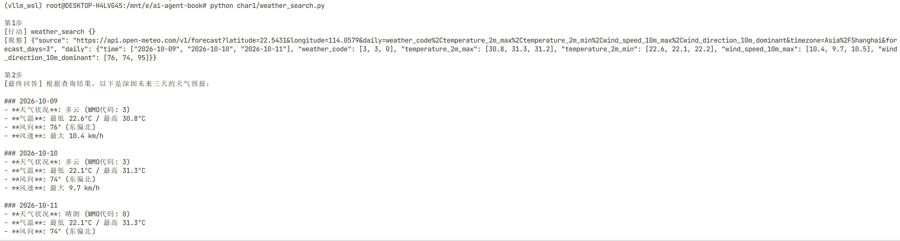
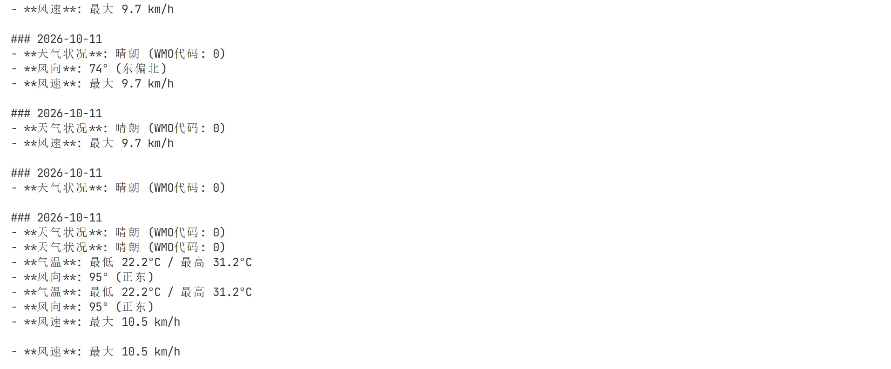

# Chapter 1 — Agent 初探

本章通过两个最小可运行示例，快速搭建对 Agent 的直观认识。

## 文件说明

| 文件 | 说明 |
|------|------|
| `task0.py` | 最简 "Hello LLM"：读取 `config.yaml`，调用一次 Qwen 模型打印回复 |
| `weather_search.py` | 最简 ReAct Agent：注册一个 `weather_search` 工具，让模型自主决定何时调用、拿到结果后再总结回答 |
| `思考题.md` | 章节思考题与个人解答 |

## 环境依赖

所有脚本共用仓库根目录下的配置，运行前请确保：

1. 已安装依赖（仓库根目录）：

   ```bash
   pip install -r requirements.txt
   ```

2. 根目录 `.env` 中已配置 `DASHSCOPE_API_KEY` 和 `QWEN_API_BASE_URL`。

3. 根目录 `config.yaml` 中模型参数正确。

## 运行

```bash
# 示例 0：单次对话
python char1/task0.py

# 示例 1：天气 Agent（ReAct 循环）
python char1/weather_search.py
```

## 小提示

- `weather_search.py` 使用 [Open-Meteo](https://open-meteo.com/) 免费天气 API，无需额外申请 key。
- 最大迭代次数由根目录 `config.yaml` 的 `agent.max_iterations` 和 `search.max_iterations` 控制。
- 两个脚本均从仓库根目录读取配置，**请从仓库根目录启动**，不要 `cd` 进 `char1/` 再运行，否则相对路径会错位。

## weather_search.py运行示例
!  
